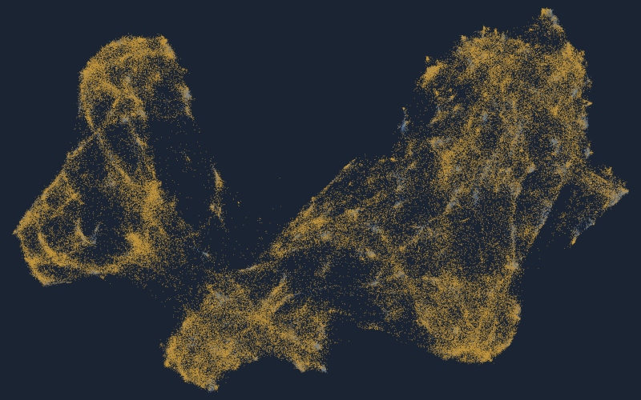

# oneground



Choosing a vector store, an index, and a sharding scheme is usually decided by
vendor leaderboards, a blog post, and whatever the last team did. oneground
measures that decision on **your own embeddings**, against exact k-NN ground
truth, and writes down every number with the seeds and digests needed to
re-derive it. It is local-first and offline: your vectors never leave the
machine, and there is no telemetry.

Part of the [oneproof](https://oneproof.dev) suite — the *Choose* door.

---

## Install

```bash
pip install oneground
oneground --help
```

Python 3.12 or newer. Extras, each named for the capability it unlocks:

| extra | for |
| --- | --- |
| `[embed]` | handing oneground text instead of vectors |
| `[view]` | the ground view and the fixture builder's projection |
| `[qdrant]` | `oneground verify` against a real Qdrant |
| `[calibrate]` | reading the ANN-Benchmarks HDF5 |
| `[test]` | running the suite |

To work on oneground rather than with it:

```bash
git clone https://github.com/oneproof/oneground && cd oneground
python -m venv .venv && . .venv/bin/activate     # Windows: .venv\Scripts\activate
pip install -r requirements.txt && pip install -e .
```

**Use that venv's interpreter explicitly.** Every command that writes a
canonical artifact refuses to run when your numpy, faiss-cpu or scikit-learn
differ from `requirements.txt`, and prints which. A measurement computed under
different libraries is not the measurement the pins describe. `--allow-unpinned`
proceeds and stamps the artifact `unpinned environment` so every reader of it
can see that.

## Characterize your corpus

Copy [`requirements.example.yaml`](requirements.example.yaml) — it is the
schema by example — point it at your vectors, and run:

```bash
oneground characterize requirements.yaml
```

The minimum it needs is a sample of vectors, some queries, and a seed:

```yaml
oneground: 1
run:
  name: support-tickets-2026q3
  seed: 20260910
  workdir: ./runs/support-tickets-2026q3
corpus:
  sample:
    kind: receipt
    vectors: {path: ./data/sample_vectors.npy}
    queries: {path: ./data/queries.npy, count_min: 50}
    target_sample_size: 20000
```

You get five numbers about the shape of your corpus:

| measure | what it answers |
|---|---|
| `intrinsic_dimensionality` | how many dimensions the data actually occupies, against how many the embedding declares |
| `boundary_crispness` | do vectors sit clearly inside one region, or on a boundary between two |
| `ambiguous_query_rate` | what share of queries cannot be routed confidently to a single shard |
| `skew_top10_share` | how much of the corpus lands in the ten largest of 256 regions |
| `drift` | what a partition trained on the past does to queries from the future |

and a directory of receipts beside them:

```
runs/support-tickets-2026q3/
  characterization.json   the measurements                     (receipt)
  sample_ids.json         which rows were measured             (receipt)
  queries_ids.json        which queries were used              (receipt)
  build_info.json         versions, device, input digests      (declared)
  MANIFEST.sha256         a digest for each of the above
```

**Receipt** means re-derivable: same inputs and seed, same bytes.
**Declared** means recorded rather than re-derivable — timestamps, library
versions, the host. The two are never blurred, and anything that could not be
measured is reported as `couldnt_check` with the reason, never filled in from
a guess. Ask for drift without a timestamp column and you get
`"couldnt_check: no timestamp_field"`, not a number.

## Check your installation against a public fixture

`fixtures/arxiv-150k` is 150,000 arXiv abstracts (CC0) embedded with pinned
weights, with exact ground truth and published values. It exists so a stranger
can confirm an installation reproduces the numbers this project publishes — it
is not a leaderboard.

```bash
oneground fixture verify arxiv-smoke
```

The picture at the top is that fixture. Almost all of it is one colour:
**84% of the vectors sit close enough to four different regions that they must
be copied into all of them.** The categories separate visibly, which is why
semantic sharding looks obviously right — and on this corpus it loses, 0.932
recall at 3.7x storage against 0.997 at 1x for a single flat index. That
result is why the tool exists.

---

## How this tool is checked against numbers that are not its own

Every recommendation is only as good as the instrument behind it, so the
instrument is measured too — against published ANN-Benchmarks results on a
corpus and a ground truth oneground did not produce, and against real engines
on your own sample.

```bash
oneground calibrate show      # the history, and the latest outcome per check
```

[docs/VALIDATION.md](docs/VALIDATION.md) is the whole picture: the three
layers, what runs weekly, and — the part worth reading first — which measures
are **validated against a reference** and which are still **predictions with
no external counterpart** (boundary crispness, ambiguous query rate, drift).
A `contradicted` result blocks a release; `couldn't-check` never does, and is
never rounded up.

---

## What exists today

Everything in this list is in `0.1.0-preview` and has been run end to end.

- **`oneground characterize`** — the five measures on your own sample, with
  receipts. Vectors (`.npy`, `.parquet`) or text (`.jsonl`) plus a pinned
  model. Tier 2 (`corpus.declared`) describes a corpus you have not embedded
  yet; it produces a fixture analogy and capacity arithmetic and **never a
  verdict**. See [docs/INTAKE.md](docs/INTAKE.md).
- **`oneground simulate`** — `single_node_hnsw`, `hash_sharded` and
  `semantic_sharded` as runnable families over your sample, against exact
  k-NN, with loss decomposed into partitioning vs. index.
- **`oneground verify`** — a real engine on the same sample. One adapter today
  (Qdrant), locally or in a matched environment on a pod where latency under
  load is attributable. See [docs/VERIFY.md](docs/VERIFY.md).
- **`oneground report`** — the trade-off surface, three outcomes per option
  (meets / fails / couldn't-check), a decision log naming every source field,
  and a deployable manifest.
- **`oneground fixture verify`** — recompute a fixture's digests **and its
  published values** and report verified / contradicted / couldn't-check for
  each.
- **`oneground fixture build`** — rebuild a fixture from its spec and seeds.
- **`oneground pod`** — run a session on rented hardware, with the money
  boundary documented in [docs/POD.md](docs/POD.md).
- **`oneground calibrate`** — measure this installation against published
  ANN-Benchmarks values and against real engines, and keep the history. See
  [docs/VALIDATION.md](docs/VALIDATION.md).
- **The arxiv-150k fixture**, `status: verified`: every digest and every
  published value reproduced on a second machine and a second operating
  system, under the same pinned versions.

## What is planned

Nothing below is implemented, and oneground will not pretend otherwise.

- **A second engine adapter** — pgvector. The `VectorEngine` protocol and its
  conformance suite exist and are the contribution gate; no second adapter
  has been written. See [CONTRIBUTING.md](CONTRIBUTING.md).
- **`qps_max`** — the highest offered rate an engine sustains before latency
  or errors break. Today's `qps` verdict answers a different question, whether
  the engine held the rate it *was* offered, and the two must never share a
  row. Documented and unimplemented in `oneground/report/verdict.py`.
- **A second corpus for the fixture analogy** — Tier 2 matches a declared
  corpus against fixtures that publish an `analogy:` block, and only
  arxiv-150k does. A support-ticket corpus therefore correctly gets *no*
  analogy today.
- **The lab** — the ground view and query traces as interactive renderers over
  the same simulator state the numbers come from.

The full plan, including what would make the project change course, is in
[docs/CHARTER.md](docs/CHARTER.md).

## Principles

- Your data or nothing. No recommendation from a canned corpus.
- No engine of our own, no favourite. Every engine behind one adapter.
- Receipts (re-derivable) and declarations (bytes frozen), never blurred.
- `couldnt_check` is never rounded up to a verdict.
- Runs on your machine. Your vectors never leave it. No telemetry.
- Nothing labelled as capability that is only planned.
